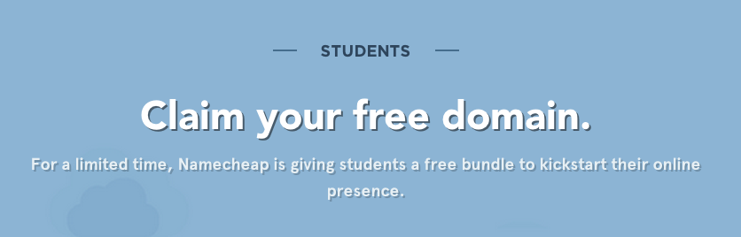

#Hackathon Guide

So with the recent interest in hackathons and HackItMac. Here's a hackathon guide. If you have questions email us at hello@hackitmac.com. Don't worry we're friendly!

##Recommanded path for learning how to make a website

Namecheap is also offering free domain names for students to kickstart their online presence. Register with your mcmaster email. What are you waiting for, make that website you always wanted!

[https://www.nc.me/](https://www.nc.me/)

##Resources

Lists resources for different technolgies
[http://adicu.com/resources](http://adicu.com/resources)

###CSS
The code that styles HTML: dictates look, layout, and general presentation. Once you've laid out your content using HTML, use CSS to make it look good.

[Learn CSS Layout](http://learnlayout.com/)
Defining how elements are position can be quite painful. But this tutorial walks you through it in concise steps.

[The Magic of CSS](http://adamschwartz.co/magic-of-css/)
An in depth tutorial on various CSS topics.